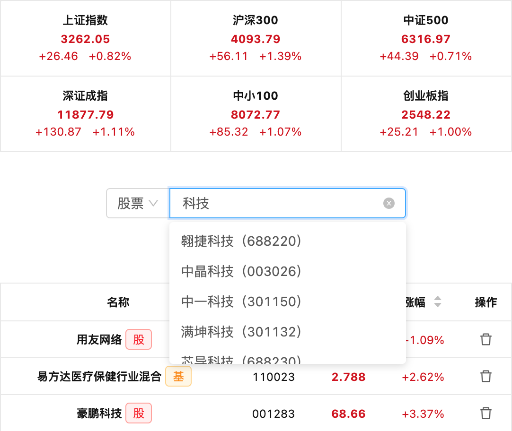
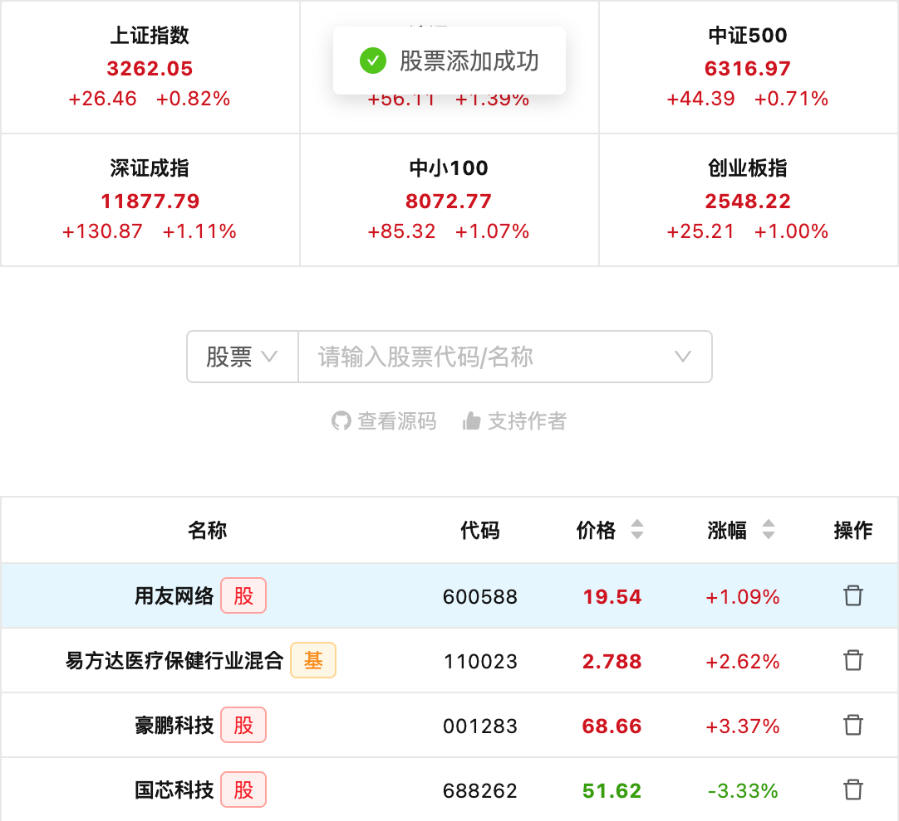
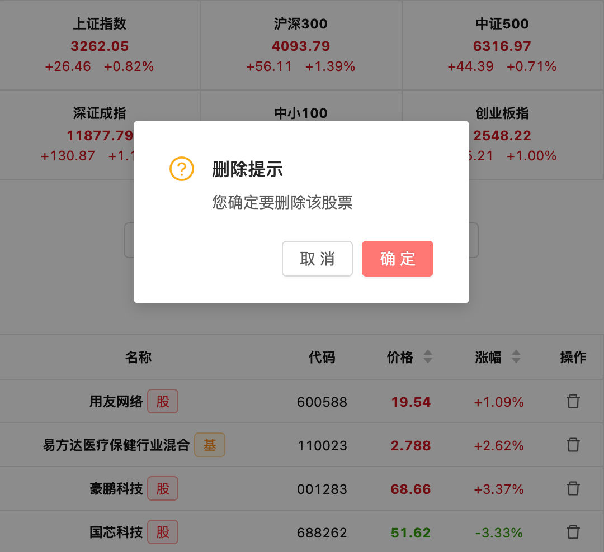

# chocolate


股票基金助手

这是一款能够自主添加和查看自选股票和基金的助手，之所以做这款插件，最大的原因就是方便，我自身也是基民，所以我尽可能的从用户的角度出发，开发了这款贴心的助手，无论上班下班，只要在浏览网页时，轻点右上角就能查看实时的财富动态。

## 技术栈

- vue-web-extension：https://github.com/Kocal/vue-web-extension/
- Ant Design Vue：https://github.com/vueComponent/ant-design-vue/

## 插件安装

- Chrome 插件商店安装：[下载地址](https://chrome.google.com/webstore/detail/%E8%82%A1%E7%A5%A8%E5%9F%BA%E9%87%91%E5%8A%A9%E6%89%8B/mebdnpnlnndmpeaomicjibfkhnjlbjgi?hl=zh-CN&authuser=0)
- Firefox 插件商店安装：[下载地址](https://addons.mozilla.org/zh-CN/firefox/addon/%E8%82%A1%E7%A5%A8%E5%9F%BA%E9%87%91%E5%8A%A9%E6%89%8B/?src=search)

## 快速开始

1. 下载源码

   ```
   git clone git@github.com:YYJeffrey/chocolate.git
   ```

2. 安装依赖  
   请确保您的 Node.js>=10，npm>=5，并使用`npm install`安装所需依赖。

3. 运行项目  
   如果你需要进行二次开发可以使用`npm run watch`进行热编译部署，如果你只需要打包则运行`npm run build`。

## 数据源

- 股票数据源：[东方财富网](https://www.eastmoney.com/)
- 基金数据源：[天天基金网](https://fund.eastmoney.com/)

## 产品展示

<br/>
<br/>
<br/>

特别鸣谢：ICON 来源——by@我是一台图标制造机（iconfont@iconchan）

## 更新记录

### v0.0.4

- 修复细节交互

### v0.0.3

- 切换了数据源，提升了响应性能
- 修复由缓存导致的 bug

### v0.0.2

- 修复已知影响使用的 bug

### v0.0.1

- 完成主要业务功能发布第一版插件
